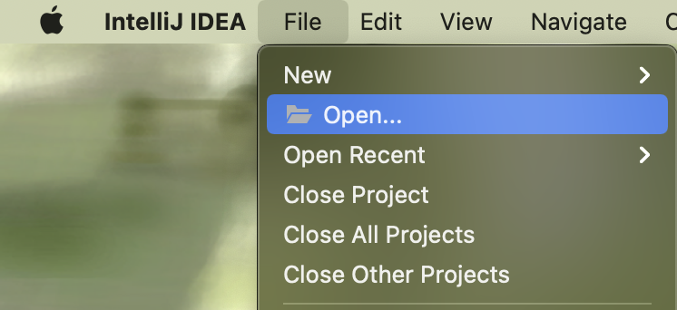
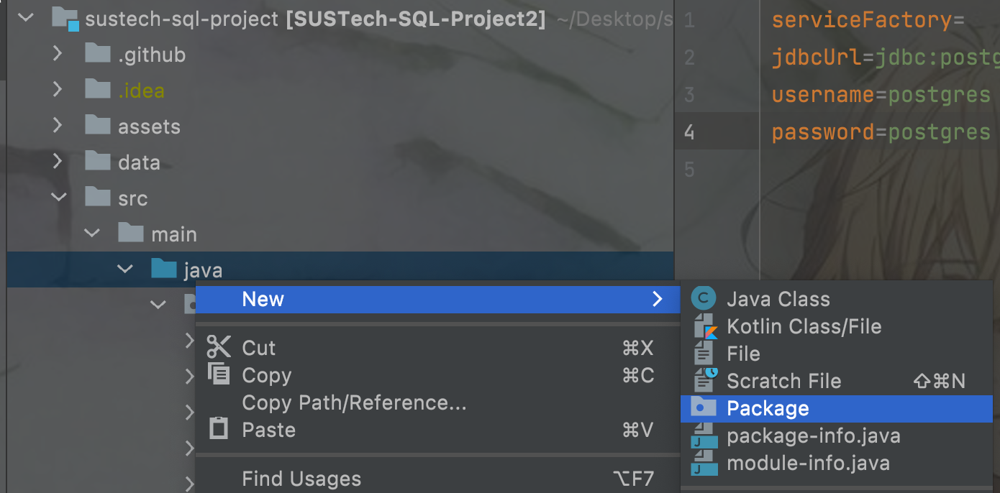
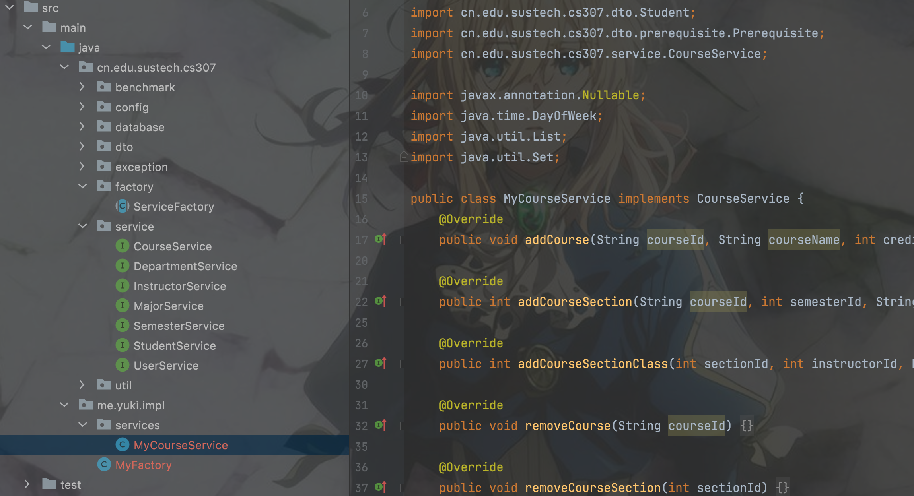
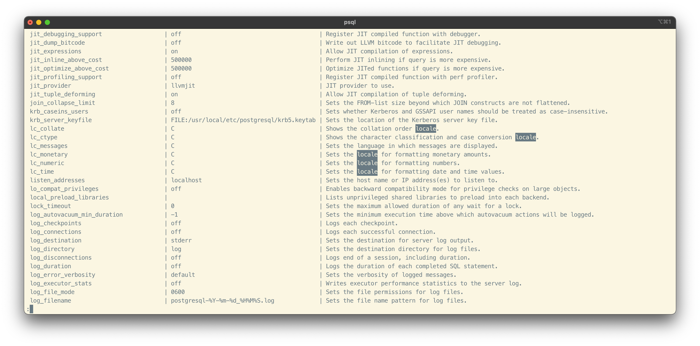
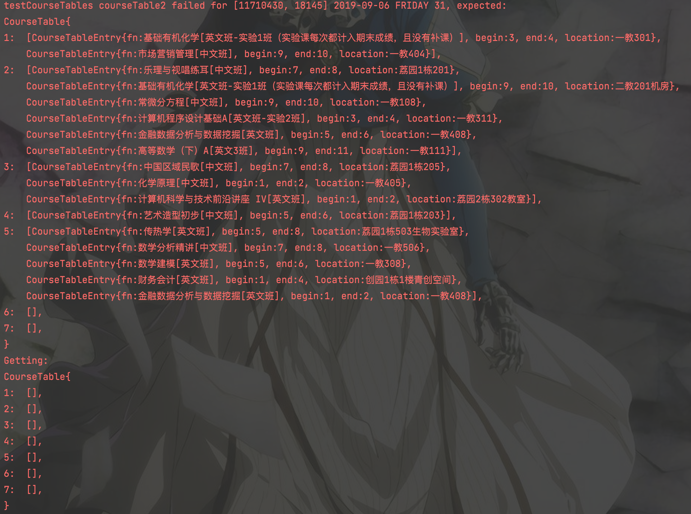
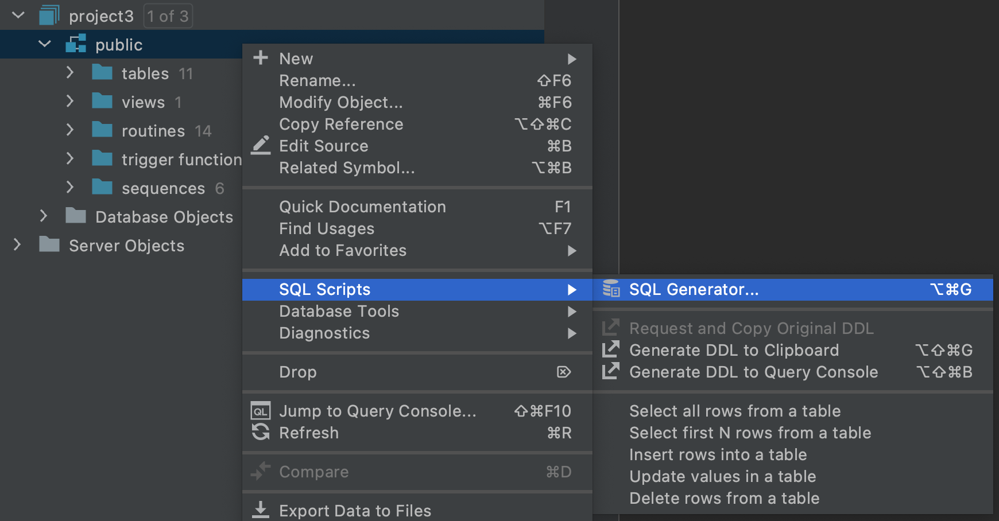
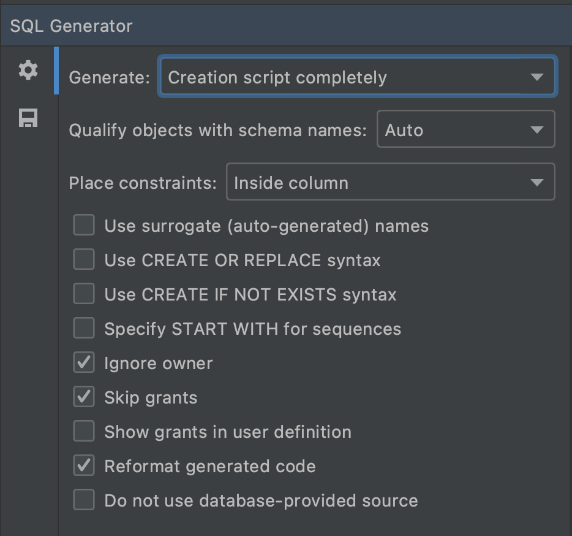

# 2021 Fall CS307 Project 2

> Contributors:
>
> Zhu Yueming , Yu Tiancheng, Lu Hongyi, Wang Ziqin, Wang Weiyu, He Yirui, Yang Xiaosu, Chen Junfeng, Li Xin, Leng Ziyang


**DEADLINE**: **Friday, December 31st, 2021, 18:30**


## Overview

This is a group project for **no more than three people**. Each group should finish the project by yourselves and submit your source code and an SQL file. The presentation will be hosted on December 31st, 2021, i.e., the last lab class. The details about the presentation will be announced later.

---

You should submit a report before the deadline, **the Topscore will be 100**; for the report submitted after the deadline and before the resubmission date, **the Topscore will be 70**; for the report submitted after the resubmission date, the score will be 0.

---

**Please be honest.** DO NOT copy ANY words, figures, and others from the Internet and others. If you use open-sourced code from the Internet, you are required to state it in comments.

---

DBMS can help us to manage data conveniently and improve the efficiency of data. 

Your work of project Part 2 is mainly divided into the following parts below: 

- Design your PostgreSQL database.
- Implement the `service` and `factory` interfaces to pass the base testcases.
- Profile your implementation and find ways to speed it up.

## Framework Source Code

Only Java is supported.

https://mirrors.sustech.edu.cn/git/sustech-2021fall-db/sustech-sql-project

**Read the README.md and this document carefully!**

## Project Guide

### Step 1: Open this project in IDEA.



### Step 2 Create and design your database.

Use the following SQL command to create database, which specifies LC_COLLATE as 'C' to ensure platform-independent
sorting result.

**Otherwise, you will always have a wrong sorting result.**

In addition, all sorting strings should be done in the database, not in java.

```sql
CREATE DATABASE your_database_name WITH ENCODING='UTF8' LC_COLLATE = 'C' TEMPLATE TEMPLATE0;
```

See [history issue](https://github.com/NewbieOrange/SUSTech-SQL-Project2-Public/issues/88),
and [stackoverflow](https://stackoverflow.com/questions/43890221/column-sorting-in-postgresql-is-different-between-macos-and-ubuntu-using-same-co)
to learn why.

You can design and test your database in DataGrip, as we taught in lab courses.

Please make sure your database can **be rebuilt by the sql file and work properly**. Checkout [Tips 3](#tips) to see how
to do.

### Step 3: Implement interfaces

Create your package and classes that implement interfaces in `cn.edu.sustech.cs307.service`. Your package shouldn't
start with `cn.`.





### Step 4: Implement ServiceFactory

Create your Factory that extends from `ServiceFactory` and register your service implements in the constructor:

```java
public class MyServiceFactory extends ServiceFactory {

    public MyServiceFactory() {
        registerService(StudentService.class, new ReferenceStudentService());
        registerService(CourseService.class, new ReferenceCourseService());
        // TODO: register Services here
    }
    /**
     * Return sids of your group members. This method is used in final judging.
     *
     * @return List of sid
     */
    @Override
    public List<String> getUIDs() {
        return List.of("12010000");
    }

    /**
     * In this method, you are required to truncate all tables of your database for this project.
     * This method is used in automatic junit tests.
     */
    @Override
    public void truncateDatabase() {
        try {
            Connection conn = SQLDataSource.getInstance().getSQLConnection();
            conn.prepareStatement("truncate table course;").execute();
            // TODO: truncate your tables here
            
            conn.close();
        } catch (SQLException e) {
            e.printStackTrace();
        }
    }
}
```

### Step 5: Modify the config.properties

```properties
serviceFactory=me.yuki.impl.MyFactory
jdbcUrl=jdbc:postgresql://localhost:5432/project3
username=yuki
password=
```

`serviceFactory` is the path of your `ServiceFactory`.

`jdbcUrl`, `username` and `password` are used to connect to your database.

### Step 6: Run the local JUnit tests

### Step 7: Run the benchmark

You can refer to reference implementation result in `data/sampleResult.txt`:

```text
Import departments
Import majors
Import users
Import semesters
Import courses
Import sections
Import classes
Import major courses
Import time usage: 2.46s
Test search course 1: 1000
Test search course 1 time: 0.53s
Test enroll course 1: 1000
Test enroll course 1 time: 0.30s
Test drop enrolled course 1: 813
Test drop enrolled course 1 time: 0.03s
Import student courses
Import student courses time: 14.19s
Test drop course: 416637
Test drop course time: 4.75s
Test course table 2: 1000
Test course table 2 time: 0.72s
Test search course 2: 1000
Test search course 2 time: 0.48s
Test enroll course 2: 1000
Test enroll course 2 time: 0.17s
```

The integer after each test case is the number of your correct result. Your program should give out exactly the same result as the reference implementation.


## What to submit

1. The source code of your project.

2. One SQL file, we will use this file to rebuild your database in the server.

   **Please read Tip.3 about how to dump your database.**

   Please make sure your database can **be rebuilt by the SQL file and work properly**.

3. A group report.

Make a zip **(NOT RAR)** file of 1 and 2, and submit this zip file and a pdf report.

Only one copy of each group should be submitted on BlackBoard.

## Tips

1. How to check the locale of a database:
   Connect to the database in Postgres shell, run command `show all;` , then find the keyword locale:

   

2. How could I know where I am wrong?

**Read the interface documents carefully.**

You are free to **modify any class** in `cn.edu.sustech.cs307`, we will replace them when testing your code in the
server.

For example, you can modify the `ProjectJudge` and dto classes to print your wrong test cases:



However, DO NOT TRY TO modify the test cases or the judger to make your code "correct". We are not idiots.

3. How to generate the SQL file that ensure database is fully rebuildable?

   Right-click the schema of your project database, click ``SQL Generator`` in ``SQL Scripts``.

   

   Please make sure your settings are consistent with the following image:

   

   Then you can copy the generated SQL, which contains all tables, indexes, and functions.
   
4. It is recommended to use git to manage group collaboration.

5. How to calculate the number of weeks during two days?

   It's recommended to use the following SQL code:

   ```sql
   SELECT (floor((day_end - day_start) / 7.0)::integer + 1) AS weekoffset;
   ```

   

   
