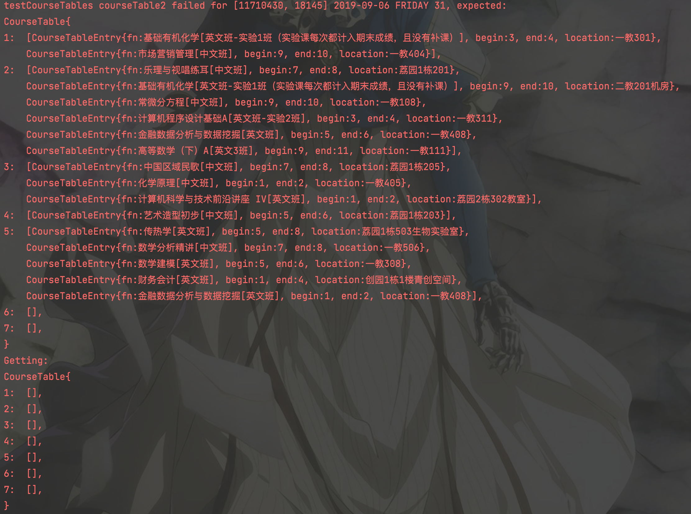

# 2021 Fall CS307 Project 2

> Contributors:
>
> Zhu Yueming , Yu Tiancheng, Lu Hongyi, Wang Ziqin, Wang Weiyu, He Yirui, Yang Xiaosu, Chen Junfeng, Li Xin, Leng Ziyang


**DEADLINE**: **Friday, December 31st, 2021, 18:30**


## Overview

This is a group project for **no more than three people**. Each group should finish the project by yourselves and submit your source code and an SQL file. The presentation will be hosted on December 31st, 2021, i.e., the last lab class. The details about the presentation will be announced later.

---

You should submit a report before the deadline, **the Topscore will be 100**; for the report submitted after the deadline and before the resubmission date, **the Topscore will be 70**; for the report submitted after the resubmission date, the score will be 0.

---

**Please be honest.** DO NOT copy ANY words, figures, and others from the Internet and others. If you use open-sourced code from the Internet, you are required to state it in comments.

---

DBMS can help us to manage data conveniently and improve the efficiency of data. 

Your work of project Part 2 is mainly divided into the following parts below: 

- Implement the service and factory interfaces to pass the base test cases. 
- Design your (PostgreSQL) database to satisfy the requirements of interfaces. 
- Profile your implementation and find ways to speed it up. 
- Make sure your result of code will be Correct(Most significant) and Effective.
- (Optional) Find other ways to implement similar functionalities as our interfaces and compare (some of) them, are they better, worse or have different use cases. 


## Framework Source Code

Only Java is supported.

https://mirrors.sustech.edu.cn/git/sustech-2021fall-db/sustech-sql-project

**Read the README.md and this document carefully!**


## A Brief User Manual

**Step 1:** Open Project in IDEA.


**Step 2:** Design your database.

Please make sure your database can **be rebuilt by the sql file and work properly**.

**Step 3:** Create your package and classes that implement interfaces in `cn.edu.sustech.cs307.service`.


**Step 4**: Create your Factory that extends from `cn.edu.sustech.cs307.factory.ServiceFactory` and register your service implements in the constructor:

Take CourseService as an example:


After registering all implementation:


For better judgment, please override `getUIDs` in your `ServiceFactory` implementation. This function should return your group members' student ids:


**Step 5:** Modify the setting files (`config.properties`) as follows:

```properties
serviceFactory=me.yuki.impl.MyFactory
jdbcUrl=jdbc:postgresql://localhost:5432/project3
username=yuki
password=
```

`serviceFactory` is the path of your `ServiceFactory`.


**Step 6:** Run the benchmark, and debug by yourselves.

You can refer to reference implementation result in `data/sampleResult.txt`:


>Import departments
>Import majors
>Import users
>Import semesters
>Import courses
>Import sections
>Import classes
>Import major courses
>Import time usage: 2.46s
>Test search course 1: 1000
>Test search course 1 time: 0.53s
>Test enroll course 1: 1000
>Test enroll course 1 time: 0.30s
>Test drop enrolled course 1: 813
>Test drop enrolled course 1 time: 0.03s
>Import student courses
>Import student courses time: 14.19s
>Test drop course: 416637
>Test drop course time: 4.75s
>Test course table 2: 1000
>Test course table 2 time: 0.72s
>Test search course 2: 1000
>Test search course 2 time: 0.48s
>Test enroll course 2: 1000
>Test enroll course 2 time: 0.17s

The integer after each test case is the number of your correct result. Your program should give out exactly the same result as the reference implementation.


## What to submit

1. The source code of your project.

2. One SQL file, we will use this file to rebuild your database in the server.

   **Please read Tip.3 about this SQL file**

   Please make sure your database can **be rebuilt by the SQL file and work properly**.

3. A group report.

Make a zip **(NOT RAR)** file of 1 and 2, and submit this zip file and a pdf report.


Only one copy of each group should be submitted on BlackBoard.


## Tips

1. How to check the locale of a database:
   Connect to the database in Postgres shell, run command `show all;` , then find the keyword locale:

   

2. How should I know where I am wrong?

   **Read the interface documents carefully.**

   You are free to **modify any class** in `cn.edu.sustech.cs307`, we will replace them when testing your code in the server.

   For example, you can modify the `ProjectJudge` and dto classes to print your wrong test cases:

   

   However, DO NOT TRY TO modify the test cases or the judger to make your code "correct". We are not idiots.

3. How to generate the SQL file that ensure database is fully rebuildable?

   Right click the schema of your project database, click ``SQL Generator`` in ``SQL Scripts``.

   

   Please make sure your settings are consistent with the following image:

   

   Then you can copy the generated SQL, which contains all tables, indexes, and functions.
   
4. It is recommended to use git to manage group collaboration.

5. How to calculate the number of weeks during two days?

   It's recommended to use the following SQL code:

   ```sql
   SELECT (floor((day_end - day_start) / 7.0)::integer + 1) AS weekoffset;
   ```

   

   
